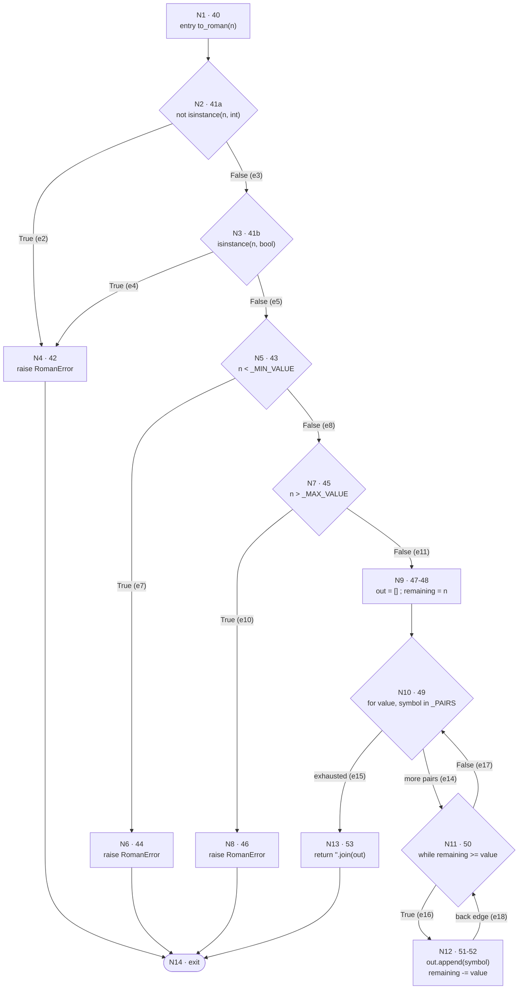

# Testing life cycle — Roman numeral converter

**Course:** Software Engineering II — ESPOL, FIEC
**System under test:** `src/roman/converter.py`
**Specification:** [SPECIFICATION.md](SPECIFICATION.md) (the oracle: when the code and the
specification disagree, the code has the defect)

| Item | Result |
|---|---|
| Inherited suite | 15 passed, unmodified |
| Final suite | 199 passed |
| Branch coverage before | **64%** |
| Branch coverage after | **99%** |
| Defects found and fixed | 3 (one per testing level) |

---

## 1. Control flow graph of `to_roman`

The graph is built from `src/roman/converter.py`, lines 40 to 53. The compound predicate of
line 41 is **decomposed**: `not isinstance(n, int) or isinstance(n, bool)` becomes two nodes,
N2 and N3, joined by the short circuit edge, because a single node would hide one of the two
ways of reaching the `raise`.

```python
40  def to_roman(n):
41      if not isinstance(n, int) or isinstance(n, bool):
42          raise RomanError("value must be an integer")
43      if n < _MIN_VALUE:
44          raise RomanError("value must be >= 1")
45      if n > _MAX_VALUE:
46          raise RomanError("value must be <= 3999")
47      out = []
48      remaining = n
49      for value, symbol in _PAIRS:
50          while remaining >= value:
51              out.append(symbol)
52              remaining -= value
53      return "".join(out)
```

> The three fixes of part 6 did not change the shape of this graph. The unit level fix changed
> one constant inside `_PAIRS`, and the other two fixes are in `from_roman`.

### 1.1 Nodes

| Node | Line(s) | Content | Kind |
|---|---|---|---|
| N1 | 40 | `def to_roman(n)`, entry | entry |
| N2 | 41a | `not isinstance(n, int)` | predicate |
| N3 | 41b | `isinstance(n, bool)` | predicate |
| N4 | 42 | `raise RomanError("value must be an integer")` | statement |
| N5 | 43 | `n < _MIN_VALUE` | predicate |
| N6 | 44 | `raise RomanError("value must be >= 1")` | statement |
| N7 | 45 | `n > _MAX_VALUE` | predicate |
| N8 | 46 | `raise RomanError("value must be <= 3999")` | statement |
| N9 | 47–48 | `out = []` ; `remaining = n` | statement block |
| N10 | 49 | `for value, symbol in _PAIRS`, loop header | predicate |
| N11 | 50 | `while remaining >= value` | predicate |
| N12 | 51–52 | `out.append(symbol)` ; `remaining -= value` | statement block |
| N13 | 53 | `return "".join(out)` | statement |
| N14 | — | exit | exit |

**N = 14**

### 1.2 Edges

| # | Edge | Condition |
|---|---|---|
| e1 | N1 → N2 | — |
| e2 | N2 → N4 | `not isinstance(n, int)` is **True** (short circuit) |
| e3 | N2 → N3 | `not isinstance(n, int)` is **False** |
| e4 | N3 → N4 | `isinstance(n, bool)` is **True** |
| e5 | N3 → N5 | `isinstance(n, bool)` is **False** |
| e6 | N4 → N14 | raise |
| e7 | N5 → N6 | `n < _MIN_VALUE` is **True** |
| e8 | N5 → N7 | `n < _MIN_VALUE` is **False** |
| e9 | N6 → N14 | raise |
| e10 | N7 → N8 | `n > _MAX_VALUE` is **True** |
| e11 | N7 → N9 | `n > _MAX_VALUE` is **False** |
| e12 | N8 → N14 | raise |
| e13 | N9 → N10 | — |
| e14 | N10 → N11 | another pair is available |
| e15 | N10 → N13 | `_PAIRS` exhausted |
| e16 | N11 → N12 | `remaining >= value` is **True** |
| e17 | N11 → N10 | `remaining >= value` is **False**, next pair |
| e18 | N12 → N11 | back edge of the `while` |
| e19 | N13 → N14 | return |

**E = 19**

### 1.3 Diagram



Text form, for reading without a renderer:

```
        N1
         |
        N2 --True--> N4 --> N14
         |False
        N3 --True--> N4
         |False
        N5 --True--> N6 --> N14
         |False
        N7 --True--> N8 --> N14
         |False
        N9
         |
   +--> N10 --exhausted--> N13 --> N14
   |     |more pairs
   |    N11 <--------+
   |     | |True     | back edge
   +-----+ N12 ------+
   (e17: while False)
```

---

## 2. Cyclomatic complexity

$$V(G) = E - N + 2 = 19 - 14 + 2 = \mathbf{7}$$

- **E = 19** edges, listed in section 1.2.
- **N = 14** nodes, listed in section 1.1.

Cross check with the number of binary predicates. The decision nodes are N2, N3, N5, N7, N10
and N11, that is **6 predicates**, and $V(G) = P + 1 = 6 + 1 = 7$. The two results agree, so the
graph is consistent with the source.

The count is 7 and not 6 precisely because the compound predicate of line 41 was decomposed.
Treated as a single node it would have given $V(G) = 6$ and would have hidden the `isinstance(n,
bool)` condition, which is the one that implements the rule of specification section 1 saying
that `True` is not 1.

---

## 3. Basis set of linearly independent paths

Seven paths, one per unit of cyclomatic complexity. Each path introduces at least one edge that
no earlier path in the list uses, which is what makes them linearly independent.

| # | Path (sequence of nodes) | New edges | Condition exercised | Test |
|---|---|---|---|---|
| P1 | N1, N2, N4, N14 | e1, e2, e6 | `n` is not an `int` | `test_p1_first_operand_true_non_integer_raises` |
| P2 | N1, N2, N3, N4, N14 | e3, e4 | `n` is an `int` but a `bool` | `test_p2_second_operand_true_bool_raises` |
| P3 | N1, N2, N3, N5, N6, N14 | e5, e7, e9 | `n < 1` | `test_p3_below_lower_bound_raises` |
| P4 | N1, N2, N3, N5, N7, N8, N14 | e8, e10, e12 | `n > 3999` | `test_p4_above_upper_bound_raises` |
| P5 | N1, N2, N3, N5, N7, N9, N10, N13, N14 | e11, e13, e15, e19 | the `for` loop makes zero iterations | infeasible, see below |
| P6 | N1, N2, N3, N5, N7, N9, N10, N11, N10, N13, N14 | e14, e17 | the `while` body never executes | infeasible, see below |
| P7 | N1, N2, N3, N5, N7, N9, N10, N11, N12, N11, N10, N13, N14 | e16, e18 | the `while` body executes | `test_p7_loop_body_executes_and_returns` |

**Feasibility.** P5 and P6 are linearly independent paths of the graph but they cannot be
executed:

- **P5** would require `_PAIRS` to be empty. `_PAIRS` is a module level constant with 13
  entries, so edge e15 is only ever reached after the loop has run.
- **P6** would require `remaining < value` for all 13 pairs. The last pair is `(1, "I")` and the
  guards at N5 and N7 guarantee `1 <= n <= 3999`, so `remaining >= 1` holds on entry and the body
  executes at least once.

This is the normal situation in basis path testing: the basis set is a property of the graph,
and infeasible members are reported rather than forced. Edges e14, e15, e17, e18 and e19 are all
covered by P7 anyway, so the seven paths still give full branch coverage of `to_roman`.

---

## 4. Definition-use table

Uses are marked **c-use** when the value is consumed in a computation, and **p-use** when it is
consumed inside a predicate. p-uses are attributed to the pair of edges leaving the decision.

| Variable | def | use | c/p | DU pair | Test that covers it |
|---|---|---|---|---|---|
| `n` | 40 (N1) | 41a (N2) | **p-use** | (40, 41a) | `test_p1_...`, `test_p7_...` |
| `n` | 40 (N1) | 41b (N3) | **p-use** | (40, 41b) | `test_p2_second_operand_true_bool_raises` |
| `n` | 40 (N1) | 43 (N5) | **p-use** | (40, 43) | `test_p3_below_lower_bound_raises` |
| `n` | 40 (N1) | 45 (N7) | **p-use** | (40, 45) | `test_p4_above_upper_bound_raises` |
| `n` | 40 (N1) | 48 (N9) | c-use | (40, 48) | `test_du_def48_puse50_and_cuse52` |
| `out` | 47 (N9) | 51 (N12) | c-use | (47, 51) | `test_p7_loop_body_executes_and_returns` |
| `out` | 47 (N9) | 53 (N13) | c-use | (47, 53) | `test_boundaries_of_the_valid_range_are_accepted` |
| `remaining` | 48 (N9) | 50 (N11) | **p-use** | **(48, 50)** | `test_du_def48_puse50_and_cuse52` |
| `remaining` | 48 (N9) | 52 (N12) | c-use | **(48, 52)** | `test_du_def48_puse50_and_cuse52` |
| `remaining` | **52 (N12)** | 50 (N11) | **p-use** | **(52, 50)** | `test_du_def52_puse50_true_and_def52_cuse52`, `test_du_def52_puse50_false_terminates_the_loop` |
| `remaining` | **52 (N12)** | 52 (N12) | c-use | **(52, 52)** | `test_du_def52_puse50_true_and_def52_cuse52` |
| `value` | 49 (N10) | 50 (N11) | **p-use** | (49, 50) | `test_p7_loop_body_executes_and_returns` |
| `value` | 49 (N10) | 52 (N12) | c-use | (49, 52) | `test_du_remaining_crosses_several_pairs` |
| `symbol` | 49 (N10) | 51 (N12) | c-use | (49, 51) | `test_p7_loop_body_executes_and_returns` |
| `_PAIRS` | 5, module | 49 (N10) | c-use | (5, 49) | every test of `to_roman` |
| `_MIN_VALUE` | 36, module | 43 (N5) | **p-use** | (36, 43) | `test_p3_below_lower_bound_raises` |
| `_MAX_VALUE` | 37, module | 45 (N7) | **p-use** | (37, 45) | `test_p4_above_upper_bound_raises` |

### 4.1 Pairs created by the redefinition of `remaining`

`remaining` is defined at line 48 from `n` and **redefined at line 52** inside the `while` body.
The redefinition kills the definition of line 48 and creates two extra pairs, shown in bold
above:

| Pair | Path from def to use | Witness | Why it matters |
|---|---|---|---|
| (48, 50) | N9 → N10 → N11, no redefinition in between | `to_roman(1)` | the *first* evaluation of the predicate, still using the initial value |
| (48, 52) | N9 → N10 → N11 → N12 | `to_roman(1)` | the initial value is consumed by the first subtraction |
| **(52, 50)** | N12 → N11 (back edge), and N12 → N11 through N10 on a later pair | `to_roman(3)`, `to_roman(10)`, `to_roman(1994)` | the loop only terminates because the *redefined* value eventually fails the predicate; a test that never re-evaluates line 50 after line 52 cannot detect an infinite loop |
| **(52, 52)** | N12 → N11 → N12, the same pair applied twice | `to_roman(3)` → `"III"` | the accumulation across iterations; `to_roman(1)` alone never exercises it |

### 4.2 What the data flow analysis revealed

The def of `value` at line 49 comes from `_PAIRS`, and its p-use at line 50 is
`remaining >= value`. Walking that pair over the 13 entries shows that the entry `(5, "IV")` sits
right after `(5, "V")` **with the same value**. The predicate cannot distinguish them, so the
`while` at N11 is always satisfied by `"V"` first and the c-use of `symbol` at line 51 can never
append `"IV"`: it is dead code. That is defect **D1**, see section 7.

---

## 5. Integration finding

### 5.1 The test that revealed it

`tests/test_integration.py::test_add_roman_result_is_accepted_by_is_valid_roman`

```python
def test_add_roman_result_is_accepted_by_is_valid_roman():
    result = add_roman("II", "II")
    assert is_valid_roman(result), f"add_roman produced a non canonical string: {result!r}"
    assert result == "IV"
```

Result before the fixes:

```
FAILED tests/test_integration.py::test_add_roman_result_is_accepted_by_is_valid_roman
AssertionError: add_roman produced a non canonical string: 'IIII'
```

### 5.2 The defect

Specification section 7 states that `add_roman` and `subtract_roman` are built on top of
`from_roman` and `to_roman`, and that **their result must be accepted by `is_valid_roman`**. The
chain is:

```
add_roman("II","II")
  -> from_roman("II") = 2,  from_roman("II") = 2        unit: correct
  -> to_roman(4)      = "IIII"                          unit: defect D1
  -> is_valid_roman("IIII") = True                      unit: defect D2
```

Two independent defects meet here and, worse, they **mask each other**. `to_roman` produces a
non canonical string, and `from_roman` — on which `is_valid_roman` is built — never checked the
canonical form, so it happily accepts that string back. The system is internally consistent and
externally wrong. It is exactly the kind of defect that only a test crossing the boundary between
two units can see.

### 5.3 Why the unit tests of each function pass without detecting it

| Unit | Its own unit tests | Why they stay green |
|---|---|---|
| `from_roman` | `from_roman("II") == 2`, `from_roman("I") == 1`, `from_roman("xi") == 11` | every input given to it is a canonical string, so the missing canonical check is never provoked |
| `to_roman` | the 15 inherited tests use 1, 2, 3, 5, 10, 50, 100, 500, 1000 | none of these nine values has a 4 or a 9 in any digit, so the subtractive branch of `_PAIRS` is never needed and the dead `(5, "IV")` entry never shows |
| `is_valid_roman` | `is_valid_roman("IV") is True` | `"IV"` *is* canonical, so the answer is right for the wrong reason |
| `add_roman` | `add_roman("IV", "VI") == "X"` | 10 has no 4 or 9 digit, so the result never passes through the broken part of `_PAIRS` |

Each function honours its contract **on the values its own tests use**. The output of `to_roman`
only becomes the input of `is_valid_roman` inside `add_roman`, and no unit test can build that
connection, because by definition a unit test stubs or ignores the rest of the system. The
inherited round trip tests, `from_roman(to_roman(7))` and `from_roman(to_roman(58))`, come close
but are also blind: 7 is `VII` and 58 is `LVIII`, neither contains a 4 or a 9, and even if they
did the round trip would still succeed, because the same missing canonical rule that lets
`to_roman` emit `"IIII"` lets `from_roman` read it back as 4.

This is the reason the specification warns against defining the canonical form as
`to_roman(from_roman(s)) == s`: the formula uses the code as its own oracle, and the two defects
would cancel out. The old helper `_roundtrip_differs` did exactly that, and it was removed.

---

## 6. Acceptance criteria

Functional, derived from `SPECIFICATION.md`, never from the source. Implemented in
`tests/test_acceptance.py`.

### AC-1 — Subtractive notation is mandatory *(section 2)*

> **Given** a user who converts a quantity to a roman numeral,
> **When** the quantity contains a digit 4 or 9 in any position,
> **Then** the system returns the subtractive form (`IV`, `IX`, `XL`, `XC`, `CD`, `CM`) and never
> writes four identical symbols in a row.

**Status before the fixes: FAILED.**
`to_roman(4)` returned `"IIII"`, `to_roman(14)` returned `"XIIII"` and `to_roman(1994)` returned
`"MCMLXXXXIIII"`.

### AC-2 — Blanks around a numeral typed by a user *(section 3)*

> **Given** a numeral typed into a user facing field, where stray blanks are common,
> **When** it arrives with whitespace before or after the symbols,
> **Then** the system trims the ends and converts it, while a numeral with a blank in the middle,
> or made of blanks only, is rejected with `RomanError`.

**Status before the fixes: FAILED.**
`from_roman("  IV  ")` raised `RomanError: invalid roman character:` and
`is_valid_roman("  IV  ")` returned `False`, when section 3 and the table of section 6 both
require 4 and `True`.

### AC-3 — Only canonical numerals are accepted *(sections 4 and 6)*

> **Given** a numeral that represents a value but is not written in canonical form, such as
> `IIII`, `VIIII`, `XXXX`, `VV` or `IVI`,
> **When** the system is asked to convert or to validate it,
> **Then** `from_roman` raises `RomanError` and `is_valid_roman` returns `False` without raising.

**Status before the fixes: FAILED.**
`from_roman("IIII")` returned 4 and `is_valid_roman("IIII")` returned `True`.

### 6.1 Which of them failed, and why coverage cannot reveal a defect of that kind

All three failed, and **they failed on code that already reported 90% branch coverage**, well
above the 85% target of part 3:

```
Name                     Stmts   Miss Branch BrPart  Cover   Missing
--------------------------------------------------------------------
src\roman\converter.py      68      6     34      0    90%   88, 92-96
--------------------------------------------------------------------
47 failed, 145 passed
```

The reason is structural. **Branch coverage measures whether the code that exists was executed.
It says nothing about code that should exist and does not.**

- **AC-2** demands a trim. The old `from_roman` had **no branch at all** for whitespace: the
  blank simply fell through to the alphabet check. There was no uncovered branch to point at,
  because the missing behaviour had no line, no node and no edge in the graph. A coverage tool
  cannot flag the absence of a node.
- **AC-3** demands the five rules of section 4. Those rules were **entirely absent** from the
  code. Every line of `from_roman` ran, every branch ran in both directions, and the function was
  still wrong.
- **AC-1** is a boundary defect inside data, not inside control flow. The `(5, "IV")` entry lives
  in a tuple, and the loop that reads `_PAIRS` was fully covered by the inherited tests. Coverage
  counts the execution of line 50, not the fact that one of the 13 iterations can never take the
  true branch for a distinct reason.

The general point of the testing life cycle: each level is planned from a different document, so
each level finds a different kind of defect. Structural testing derives cases from the code and
can only find defects that the code *expresses*. Functional testing derives cases from the
specification and is the only level that can find **omissions**, which are defects the code does
not express at all. Coverage is a measure of test thoroughness against the implementation, never
a measure of correctness against the requirements.

---

## 7. Defects fixed

One commit per fix, each stating the level of testing that found it.

| # | Defect | Level that found it | Spec section | Commit |
|---|---|---|---|---|
| D1 | `_PAIRS` contained `(5, "IV")` instead of `(4, "IV")`, so the `"IV"` symbol was unreachable and `to_roman(4)` returned `"IIII"` | **unit** | 2 | `fix(unit): correct the value of the IV entry in _PAIRS per spec section 2` |
| D2 | `from_roman` summed the symbols without checking the canonical form, so `from_roman("IIII")` was 4 and `is_valid_roman("IIII")` was `True` | **integration** | 4, 6, 7 | `fix(integration): reject non canonical numerals per spec sections 4, 6 and 7` |
| D3 | `from_roman` did not trim leading and trailing whitespace, so `from_roman("  IV  ")` raised | **acceptance** | 3 | `fix(acceptance): trim surrounding whitespace in from_roman per spec section 3` |

**D1** — one character in a constant: `(5, "IV")` became `(4, "IV")`.

**D2** — the string is now read as the sequence of **groups** of section 4, and the five formal
rules are applied by `_check_canonical`: at most three `I`, `X`, `C` or `M` in a row; at most one
`V`, `L` or `D` in the whole string; only the six subtractive pairs and each at most once;
non increasing group values; and after a subtractive pair, every following group worth less than
the subtracted symbol. The dead helper `_roundtrip_differs` was removed, because section 4
explicitly forbids using `to_roman(from_roman(s)) == s` as the criterion — the code would be its
own oracle. `_count_char`, the other unused helper, now backs rule 2.

**D3** — `s.upper()` became `s.strip().upper()`. `strip()` only touches the ends, so `"X I"`
still raises, and a string of blanks collapses to `""`, which the existing guard rejects.

The 15 inherited tests were not modified, and they pass unchanged.

---

## 8. Coverage

### 8.1 Before — part 2 baseline, inherited suite only

```
$ pytest --cov=roman.converter --cov-branch --cov-report=term-missing

platform win32 -- Python 3.14.2, pytest-9.1.1, pluggy-1.6.0
collected 15 items

tests\test_converter.py ...............                                  [100%]

Name                     Stmts   Miss Branch BrPart  Cover   Missing
--------------------------------------------------------------------
src\roman\converter.py      68     24     34      9    64%   42, 44, 46, 58, 61, 64,
                                                            72-74, 79, 83, 88, 92-96,
                                                            100-104, 108, 112
--------------------------------------------------------------------
TOTAL                       68     24     34      9    64%
============================= 15 passed in 0.15s ==============================
```

Everything the inherited suite never reaches: the three `raise` of `to_roman`, all the guards of
`from_roman`, the subtractive pair branch, the whole of `is_valid_roman`, `add_roman` and
`subtract_roman`, and the two unused helpers.

### 8.2 Intermediate — new suite added, no fixes yet

```
src\roman\converter.py      68      6     34      0    90%   88, 92-96
TOTAL                       68      6     34      0    90%
47 failed, 145 passed
```

The evidence for section 6.1: **90% branch coverage with 47 failing tests**. The only lines still
missing are the two helpers that were dead code.

### 8.3 After — full suite, all three fixes applied

```
$ pytest --cov=roman.converter --cov-branch --cov-report=term-missing

platform win32 -- Python 3.14.2, pytest-9.1.1, pluggy-1.6.0
collected 199 items

tests\test_acceptance.py ...........................................     [ 21%]
tests\test_converter.py ...............                                  [ 29%]
tests\test_integration.py .............................................. [ 52%]
.                                                                        [ 52%]
tests\test_unit_from_roman.py .......................................... [ 73%]
................                                                         [ 81%]
tests\test_unit_to_roman.py ....................................         [100%]

Name                     Stmts   Miss Branch BrPart  Cover   Missing
--------------------------------------------------------------------
src\roman\converter.py      93      1     54      1    99%   122
--------------------------------------------------------------------
TOTAL                       93      1     54      1    99%
============================= 199 passed in 0.36s =============================
```

| | Before | After |
|---|---|---|
| Branch coverage | 64% | **99%** |
| Statements / branches | 68 / 34 | 93 / 54 |
| Tests | 15 | 199 |
| Result | 15 passed | **199 passed** |

**The one remaining line.** Line 122, `raise RomanError("value out of range 1..3999")`, is now
unreachable. Once the canonical rules of D2 are enforced, the largest string the parser can
accept is `MMMCMXCIX` = 3999 and the smallest is `I` = 1, so the range guard can never fire:
`"MMMM"` is rejected earlier by rule 1, four `M` in a row. It is kept as a defensive guard, and
the behaviour the specification requires for `"MMMM"` — a `RomanError` — is still verified by
`test_value_above_the_range_raises`.

---

## 9. How to reproduce

```bash
python -m venv .venv && source .venv/bin/activate    # Windows: .venv\Scripts\activate
pip install -r requirements.txt -e .

pytest                                                       # 199 passed
pytest --cov=roman.converter --cov-branch --cov-report=term-missing

git log --oneline                                            # one commit per fix
python -m roman 4 IV 1994 "  IX  " IIII                      # command line check
```

## 10. Test suite layout

| File | Level | Derived from | Tests |
|---|---|---|---|
| `tests/test_converter.py` | unit | inherited, **not modified** | 15 |
| `tests/test_unit_to_roman.py` | unit, structural | control flow graph and DU pairs of `to_roman` | 36 |
| `tests/test_unit_from_roman.py` | unit, structural | branches of `from_roman` and `is_valid_roman` | 58 |
| `tests/test_integration.py` | integration | specification section 7, collaborations | 47 |
| `tests/test_acceptance.py` | acceptance, functional | specification sections 2, 3, 4, 6 | 43 |
| | | **total** | **199** |
